In this module, you’ll start by understanding the event-driven heart of Node.js and explore how it handles tasks synchronously and asynchronously, especially when it comes to reading files, working with buffers, and streaming data efficiently.


But that’s just the beginning…

By the end of this module, you’ll be:

Building your own logger app to track events and activities
Navigating the filesystem using the Path module
Creating a basic ToDo app using Node’s native HTTP server
Implementing routing, setting custom response headers, and using Postman to test your API
Handling CRUD operations (Create, Read, Update, Delete) on ToDos with real HTTP requests—query params and all!


This module bridges the gap between learning and doing. It's where you transform knowledge into projects, gain confidence in Node.js fundamentals, and start thinking like a real backend developer.


Let’s go—your first full Node-powered app is just a few lessons away!
## 13-1 What is an event module?
```js
const EventEmitter = require('node:events');// Node.js এর events মডিউল থেকে EventEmitter ক্লাসকে require করে নিয়ে এসেছি।

//এই EventEmitter হচ্ছে একটি বিল্ট-ইন ক্লাস যা দিয়ে ইভেন্ট তৈরি, শুনা (listen), এবং রেসপন্স করা যায়।

class SchoolBell extends EventEmitter{} ;// SchoolBell নামে একটি নতুন ক্লাস তৈরি করছি।

//এই ক্লাসটি EventEmitter কে extend করেছে। অর্থাৎ SchoolBell এখন EventEmitter এর সব ফিচার ব্যবহার করতে পারবে — যেমন .on(), .emit() ইত্যাদি।
const schoolBell = new SchoolBell(); //SchoolBell ক্লাস থেকে schoolBell নামে একটি ইনস্ট্যান্স (object) তৈরি করলাম।

// এই ইনস্ট্যান্স দিয়েই আমরা ইভেন্ট রেজিস্টার করবো এবং ট্রিগার করবো।

schoolBell.on("ring",()=>{
    console.log("yahoo  class sesh")
});
schoolBell.on("ring",()=>{
    console.log("Dhat arekta class ase")
});

schoolBell.on("broken",()=>{
    console.log("oh no bell is broken")
})

schoolBell.emit("ring")
schoolBell.emit("broken")
```

## 13-3 Asynchronous way to read and write files
- asynchronous readfile 
 ###### syntax => fs.readFile(path, options, callback);
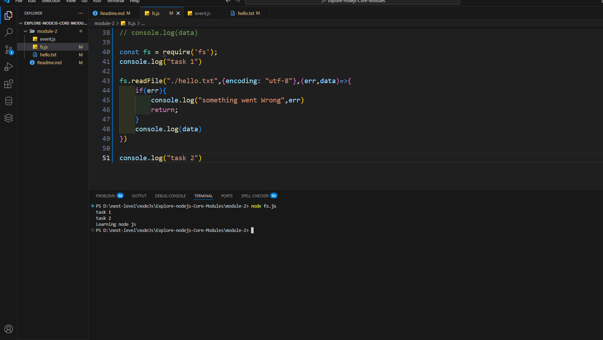
 
```js

const fs = require('fs');
console.log("task 1")

fs.readFile("./hello.txt",{encoding: "utf-8"},(err,data)=>{
    if(err){
        console.log("something went Wrong",err)
        return;
    }
    console.log(data)
})

console.log("task 2")
```

```js
/// write file =============

// Syntax
// fs.writeFile(file, data, options, callback);

let text="munna vi"
fs.writeFile("./hello.txt",text,{encoding: "utf-8"},(err)=>{
    if(err){
        console.log("something went Wrong",err)
        return;
    }
    console.log( " writing data successfull")
})
```
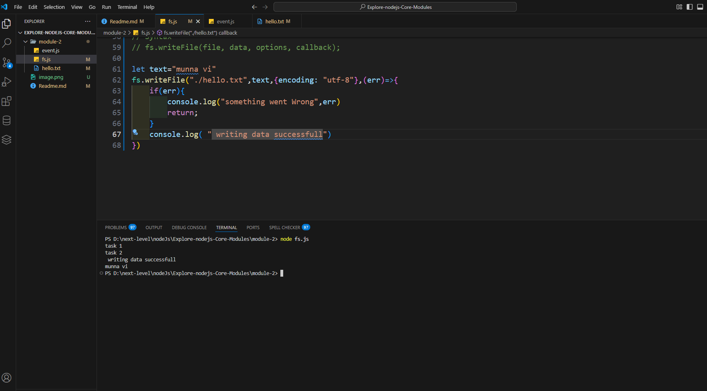

## 13-4 Buffer and Streaming
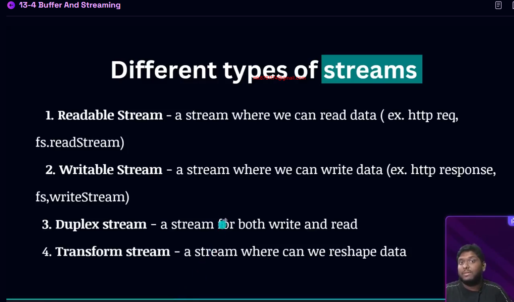

```js
const fs = require("fs");

const readStream = fs.createReadStream("./hello.txt", { encoding: "utf-8" });
const writeStream = fs.createWriteStream("./helloWorld.txt", { encoding: "utf-8" });

// When data is read from the input file
readStream.on("data", (data) => {
    console.log(data); // print the chunk

    writeStream.write(data, (err) => {
        if (err) {
            throw new Error("Write error: " + err); // ✅ FIXED: correct error handling
        }
    });
});

// Handle reading errors
readStream.on("error", (err) => {
    if (err) {
        throw new Error("Read error: " + err); // ✅ FIXED: correct error handling
    }
});

// When reading is finished
readStream.on("end", () => {
    console.log("Reading successfully completed");
    writeStream.end(); // finish the write stream
});

// When writing is finished
writeStream.on("finish", () => {
    console.log("Writing successfully completed");
});
```
## 13-5 Making a basic logger app & Path module
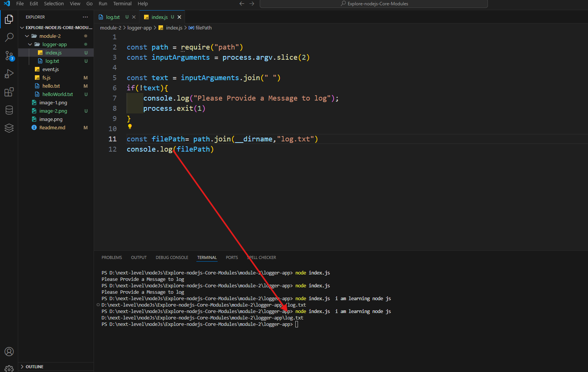
# 📘 13-5: Making a Basic Logger App & Path Module

A basic Node.js CLI logger app that writes user messages with timestamps into a `log.txt` file using the `fs` and `path` modules.

---

## 🚀 Features

* Accept user-defined message from the terminal.
* Append message along with timestamp into a log file.
* Automatically creates the log file if it doesn’t exist.
* Uses Node.js built-in modules: `fs`, `path`, and `process`.

---

## 📁 Folder Structure

```
log-app/
│
├── log.js          # Main logger script
└── log.txt         # Output log file
```

---

## 🧑‍💻 How to Use

### 1. Open your terminal.

### 2. Run the following command:

```bash
node log.js "Your message goes here"
```

✅ Example:

```bash
node log.js "Server started"
```

---

## 📄 Sample Output in `log.txt`

```
Server started Sat May 31 2025 16:00:12 GMT+0600 (Bangladesh Standard Time)
```

---

## ⚙️ Code Explanation

```js
const path = require("path");
const fs = require("fs");

// Get arguments from terminal input
const inputArguments = process.argv.slice(2);
const text = inputArguments.join(" ");
const timestamp = new Date();
const message = `${text} ${timestamp} \n`;

// Input validation
if (!message) {
    console.log("Please provide a message to log");
    process.exit(1);
}

// Set the path to the log file
const filePath = path.join(__dirname, "log.txt");

// Append log message to the file
fs.appendFile(filePath, message, { encoding: "utf-8" }, () => {
    console.log("✅ Log added successfully");
});

console.log("📝 Log saved at:", filePath);
```

---

## 💡 Why Use `path` Module?

* To create a consistent file path across different operating systems.
* `path.join(__dirname, "filename")` ensures the correct full path regardless of OS.


## 13-6 Creating a todo app with basic http server using nodejs

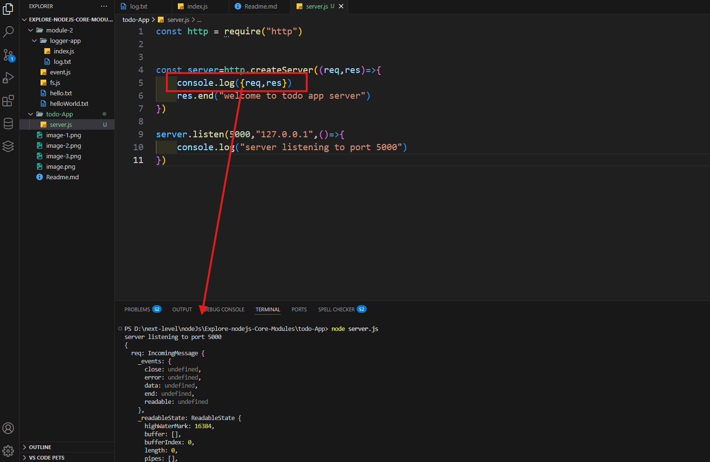
when i console req and res and get in postman
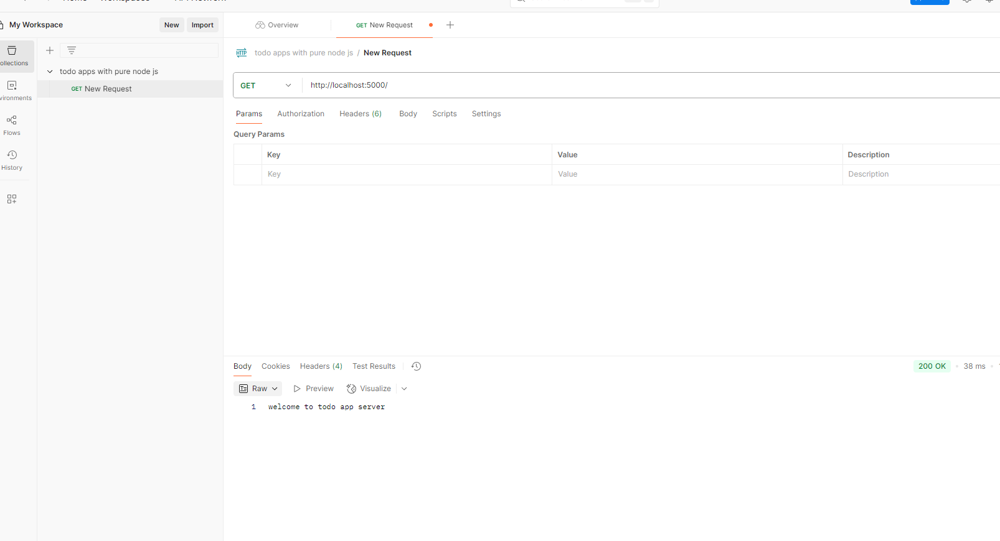

```js
const http = require("http")


const server=http.createServer((req,res)=>{
    console.log({req,res})
    res.end("welcome to todo app server")
})

server.listen(5000,"127.0.0.1",()=>{
    console.log("server listening to port 5000")
})
```

## 13-7 Routing in node js

```js
const http = require("http")


const server=http.createServer((req,res)=>{
   if(req.url === "/todos" && req.method ==="GET"){
    res.end("ALL Todos")
   }else if(req.url === "/todos/create-todo" && req.method ==="POST"){
    res.end("Todo Created")
   } else{
    res.end("404")
   }
})

server.listen(5000,"127.0.0.1",()=>{
    console.log("server listening to port 5000")
})
/**\
 * /todos Get -all todo
 * 
 * /todos /create todos post create
 */
```
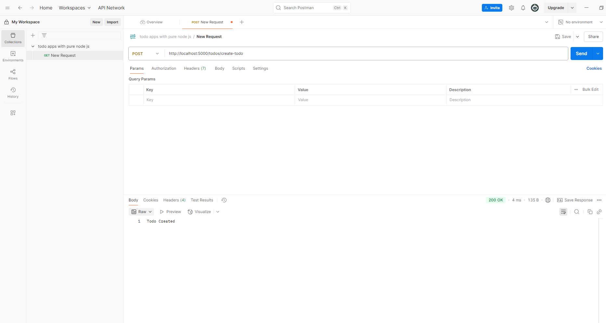

## 13-8 Set response headers

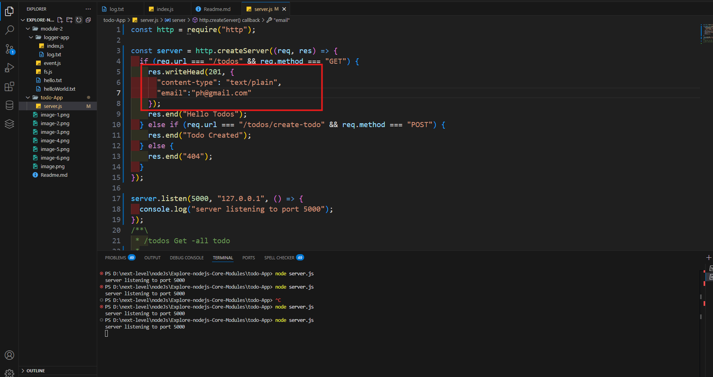

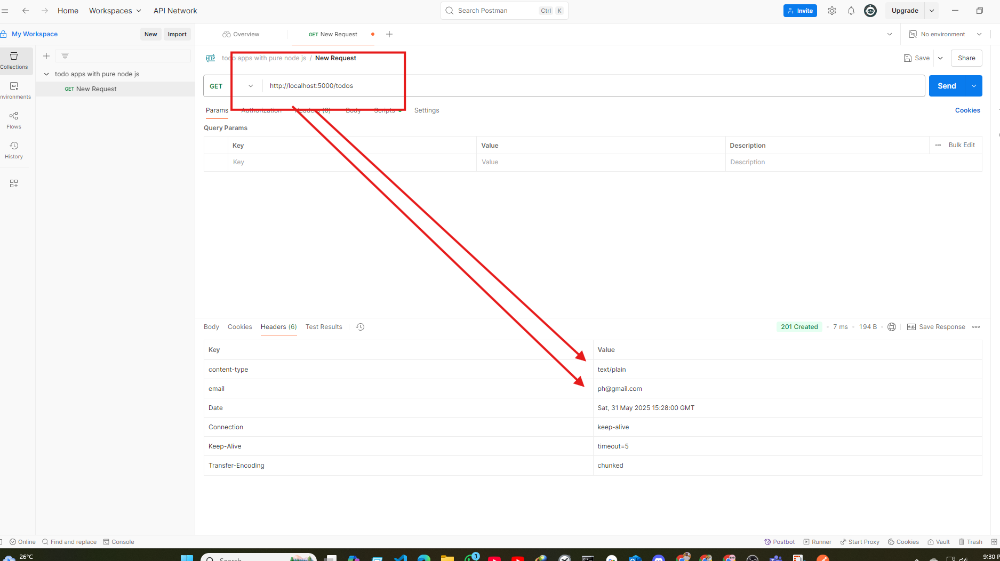
- we can send it application/json file
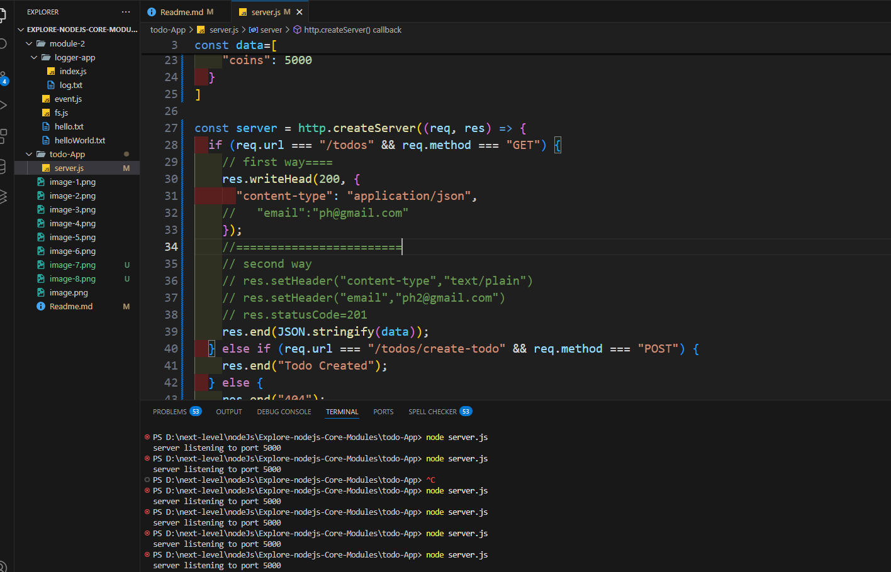
- as use well we can send text/html
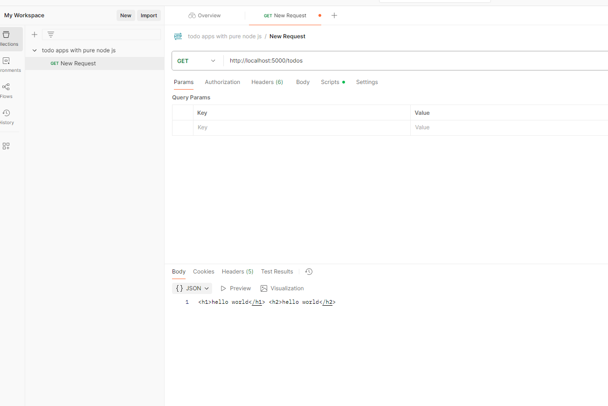
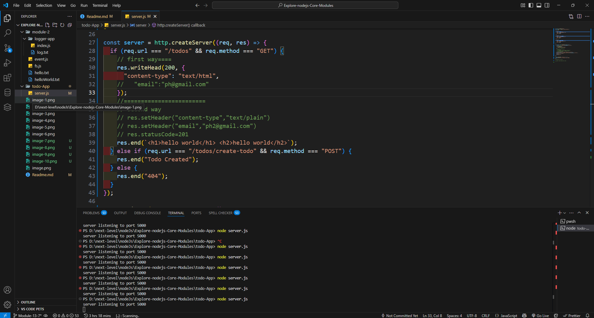

```js
const http = require("http");
const { json } = require("stream/consumers");
const data=[
  {
    "id": 1,
    "name": "Munna Khan",
    "email": "mk8761174@gmail.com",
    "role": "Worker",
    "coins": 1300
  },
  {
    "id": 2,
    "name": "Ayesha Rahman",
    "email": "ayesha@example.com",
    "role": "Buyer",
    "coins": 800
  },
  {
    "id": 3,
    "name": "Tanvir Hasan",
    "email": "tanvir@example.com",
    "role": "Admin",
    "coins": 5000
  }
]

const server = http.createServer((req, res) => {
  if (req.url === "/todos" && req.method === "GET") {
    // first way====
    res.writeHead(200, {
      "content-type": "text/html",
    //   "email":"ph@gmail.com"
    });
    //========================
    // second way
    // res.setHeader("content-type","text/plain")
    // res.setHeader("email","ph2@gmail.com")
    // res.statusCode=201
    res.end(`<h1>hello world</h1> <h2>hello world</h2>`);
  } else if (req.url === "/todos/create-todo" && req.method === "POST") {
    res.end("Todo Created");
  } else {
    res.end("404");
  }
});

server.listen(5000, "127.0.0.1", () => {
  console.log("server listening to port 5000");
});
/**\
 * /todos Get -all todo
 *
 * /todos /create todos post create
 */
```
## 13-9 Creating and Reading A ToDo using Postman
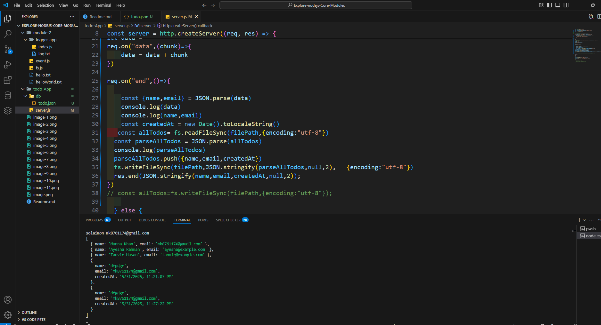
lets use our file system for database.

we will create indentation while doing stringify, i mean this will give space an something
```js

fs.writeFileSync(filePath, JSON.stringify(parsedAllTodos, null, 2), {
  encoding: "utf-8",
});
res.end(JSON.stringify({ title, body, createdAt }, null, 2));
```
```js
const http = require("http");
const path=require ("path")
const filePath=path.join(__dirname, "./db/todo.json")
const fs = require("fs");


// Get All todos
const server = http.createServer((req, res) => {
  if (req.url === "/todos" && req.method === "GET") {
    const data = fs.readFileSync(filePath,{encoding:"utf-8"})
    res.writeHead(200, {
      "content-type": "application/json",
  
    });
  
    res.end(data);
  }
  // post todos
  else if (req.url === "/todos/create-todo" && req.method === "POST") {
let data = ""
req.on("data",(chunk)=>{
    data = data + chunk
})

req.on("end",()=>{
  
    const {name,email} = JSON.parse(data)
    console.log(data)
    console.log(name,email)
    const createdAt = new Date().toLocaleString()
   const allTodos= fs.readFileSync(filePath,{encoding:"utf-8"})
  const parseAllTodos = JSON.parse(allTodos)
  console.log(parseAllTodos)
  parseAllTodos.push({name,email,createdAt})
  fs.writeFileSync(filePath,JSON.stringify(parseAllTodos,null,2),   {encoding:"utf-8"})
  res.end(JSON.stringify(name,email,createdAt,null,2));
})
// const allTodos=fs.writeFileSync(filePath,{encoding:"utf-8"});
    
  } else {
    res.end("404");
  }
});

server.listen(5000, "127.0.0.1", () => {
  console.log("server listening to port 5000");
});
/**\
 * /todos Get -all todo
 *
 * /todos /create todos post create
 */
```

## 13-10 Get Single ToDo with Query Params

##### get single todo
```js
// single todo
  else   if ( pathname ==="/todo" && req.method === "GET") {
  const name = url.searchParams.get("name")
 const data = fs.readFileSync(filePath,{encoding:"utf-8"})
 const parsedData=JSON.parse(data)
 const todo = parsedData.find((todo)=> todo.name===name)
 const stringifiedTodo=JSON.stringify(todo)
    res.writeHead(200, {
      "content-type": "application/json",
  
    });
  
    res.end(stringifiedTodo);
  

  }
  ```
  ##### full code 
  ```js
  const http = require("http");
const path=require ("path")
const filePath=path.join(__dirname, "./db/todo.json")
const fs = require("fs");
const { json } = require("stream/consumers");


// Get All todos
const server = http.createServer((req, res) => {
const url = new URL(req.url,`http://${req.headers.host}`);
const pathname=url.pathname

  if ( pathname === "/todos" && req.method === "GET") {
    const data = fs.readFileSync(filePath,{encoding:"utf-8"})
    res.writeHead(200, {
      "content-type": "application/json",
  
    });
  
    res.end(data);
  }
  // post todos
  else if ( pathname=== "/todos/create-todo" && req.method === "POST") {
let data = ""
req.on("data",(chunk)=>{
    data = data + chunk
})

req.on("end",()=>{
  
    const {name,email} = JSON.parse(data)
    console.log(data)
    console.log(name,email)
    const createdAt = new Date().toLocaleString()
   const allTodos= fs.readFileSync(filePath,{encoding:"utf-8"})
  const parseAllTodos = JSON.parse(allTodos)
  console.log(parseAllTodos)
  parseAllTodos.push({name,email,createdAt})
  fs.writeFileSync(filePath,JSON.stringify(parseAllTodos,null,2),   {encoding:"utf-8"})
  res.end(JSON.stringify(name,email,createdAt,null,2));
})
// const allTodos=fs.writeFileSync(filePath,{encoding:"utf-8"});
    
  }
  // single todo
  else   if ( pathname ==="/todo" && req.method === "GET") {
  const name = url.searchParams.get("name")
 const data = fs.readFileSync(filePath,{encoding:"utf-8"})
 const parsedData=JSON.parse(data)
 const todo = parsedData.find((todo)=> todo.name===name)
 const stringifiedTodo=JSON.stringify(todo)
    res.writeHead(200, {
      "content-type": "application/json",
  
    });
  
    res.end(stringifiedTodo);
  

  }
});

server.listen(5000, "127.0.0.1", () => {
  console.log("server listening to port 5000");
});
/**\
 * /todos Get -all todo
 *
 * /todos /create todos post create
 */
```
## 13-11 Updating and Deleting Todo
```js
const http = require("http");
const path = require("path");
const filePath = path.join(__dirname, "./db/todo.json");
const fs = require("fs");
const { json } = require("stream/consumers");

// Get All todos
const server = http.createServer((req, res) => {
  const url = new URL(req.url, `http://${req.headers.host}`);
  const pathname = url.pathname;

  if (pathname === "/todos" && req.method === "GET") {
    const data = fs.readFileSync(filePath, { encoding: "utf-8" });
    res.writeHead(200, {
      "content-type": "application/json",
    });

    res.end(data);
  }
  // post todos
  else if (pathname === "/todos/create-todo" && req.method === "POST") {
    let data = "";
    req.on("data", (chunk) => {
      data = data + chunk;
    });

    req.on("end", () => {
      const { name, email } = JSON.parse(data);
      console.log(data);
      console.log(name, email);
      const createdAt = new Date().toLocaleString();
      const allTodos = fs.readFileSync(filePath, { encoding: "utf-8" });
      const parseAllTodos = JSON.parse(allTodos);
      console.log(parseAllTodos);
      parseAllTodos.push({ name, email, createdAt });
      fs.writeFileSync(filePath, JSON.stringify(parseAllTodos, null, 2), {
        encoding: "utf-8",
      });
      res.end(JSON.stringify(name, email, createdAt, null, 2));
    });
    // const allTodos=fs.writeFileSync(filePath,{encoding:"utf-8"});
  }
  // single todo
  else if (pathname === "/todo" && req.method === "GET") {
    const name = url.searchParams.get("name");
    const data = fs.readFileSync(filePath, { encoding: "utf-8" });
    const parsedData = JSON.parse(data);
    const todo = parsedData.find((todo) => todo.name === name);
    const stringifiedTodo = JSON.stringify(todo);
    res.writeHead(200, {
      "content-type": "application/json",
    });

    res.end(stringifiedTodo);
  }
  // update todo
  else if (pathname === "/todos/update-todo" && req.method === "PATCH") {
      const name = url.searchParams.get("name");
    let data = "";
    req.on("data", (chunk) => {
      data = data + chunk;
    });

    req.on("end", () => {
      const {  email } = JSON.parse(data);
    
     
      const allTodos = fs.readFileSync(filePath, { encoding: "utf-8" });
      const parseAllTodos = JSON.parse(allTodos);
      
      const todoIndex=parseAllTodos.findIndex((todo)=>todo.name ===name)

      parseAllTodos[todoIndex].email=email      
      fs.writeFileSync(filePath, JSON.stringify(parseAllTodos, null, 2), {
        encoding: "utf-8",
      });
      res.end(JSON.stringify({name, email, createdAt:parseAllTodos[todoIndex].createdAt}, null, 2));
    });
    // const allTodos=fs.writeFileSync(filePath,{encoding:"utf-8"});
  }
});

server.listen(5000, "127.0.0.1", () => {
  console.log("server listening to port 5000");
});
/**\
 * /todos Get -all todo
 *
 * /todos /create todos post create
 */
```